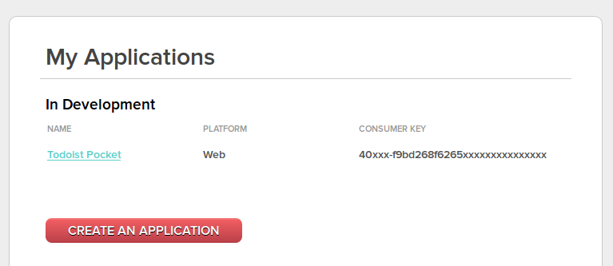
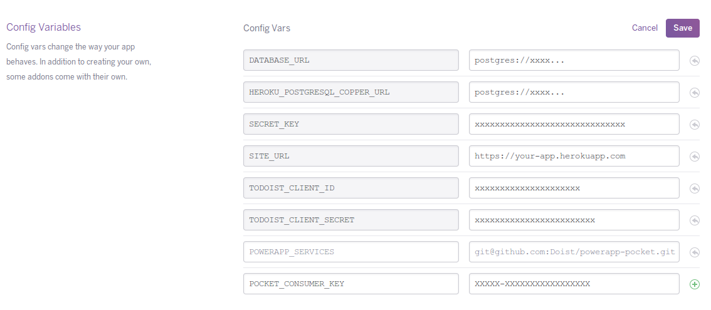

Service for Todoist to Pocket integration
-----------------------------------------

This app creates a new project in your Todoist account and starts
monitoring tasks in it. As soon as you create a task there
(or move the task from other projects), URLs from it will be extracted and added to your
pocket account.

In order to install the service, log in to your Pocket account and create
a new application here: http://getpocket.com/developer/apps/new .

Notice the "consumer key" created for you. It will be required to identify your PowerApp
installation on Pocket.

Then follow instructions for Heroku or self-hosted installations.

Installation instructions for Heroku
------------------------------------

Extend your configuration with two variables. `POWERAPP_SERVICES` has to be
extended with the URL of the repository on github: `https://github.com/Doist/powerapp-pocket`.

Create a new variable with this name if it doesn't exist yet.
Then create a `POCKET_CONSUMER_KEY` key with a variable copied from your
Pocket settings.

It can be done either from command line::

    heroku config:set POWERAPP_SERVICES=https://github.com/Doist/powerapp-pocket
    heroku config:set POCKET_CONSUMER_KEY=XXXXX-XXXXXXXXXXXXXXXXX

Or from Heroku web interface:

Installation instructions for local of self-hosted setups
---------------------------------------------------------

Install the extension in your development virtual environment::

    pip install -e git+https://github.com/Doist/powerapp-pocket#egg=powerapp-pocket

Extend your `.env` file with a string like::

    POCKET_CONSUMER_KEY=XXXXX-XXXXXXXXXXXXXXXXX

Collect static and services::

    ./manage.py collectstatic --noinput
    ./manage.py collect_services

Start (or restart) the uwsgi process::

    uwsgi uwsgi.ini
